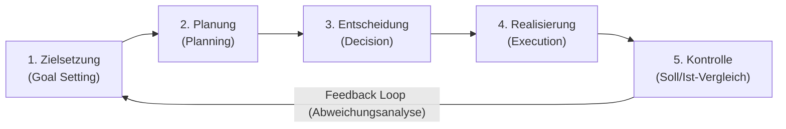

# Organizational Engineering (Aufbau & Ablauf), Management Levels & The Management Control Loop
*Date: 01-09-2026* | *Category: #business-administration #process-management #management-theory*

---

## Context — Kontext

**🇬🇧** Today at school, we continued our deep dive into **Lernfeld 1 (LF1.2)**, exploring how organizations design their static structures (*Aufbauorganisation*) and dynamic workflows (*Ablauforganisation*) through systematic analysis and synthesis. We also evaluated executive management levels (Top, Middle, Lower) and the cyclical 5-step **Management Control Loop**.

**🇩🇪** Heute haben wir die Vertiefung von **Lernfeld 1 (LF1.2)** fortgesetzt und untersucht, wie Organisationen ihre statische Struktur (*Aufbauorganisation*) und dynamische Prozesse (*Ablauforganisation*) durch systematische Analyse und Synthese gestalten. Zudem haben wir Management-Ebenen (Top, Middle, Lower) sowie den 5-stufigen **Management-Regelkreis** analysiert.

---

## Key Topics — Hauptthemen

### 1. Structural vs. Process Organization — Aufbau- und Ablauforganisation

**🇬🇧** Organizational design follows a two-pillar methodology: first establishing *what* needs to be done and *who* does it (static structure), then defining *how*, *when*, and *where* it happens (dynamic workflow):
**🇩🇪** Die Organisationsgestaltung basiert auf zwei Säulen: Zuerst wird festgelegt, *was* getan werden muss und *wer* zuständig ist (statisch), danach *wie*, *wann* und *wo* die Ausführung erfolgt (dynamisch):

```
Gesamtaufgabe (Overall Goal)
    ├── [ Aufgabenanalyse ] ──► Elementaraufgaben ──► [ Aufgabensynthese ] ──► Stellen & Abteilungen (Aufbauorganisation)
    └── [ Ablaufanalyse   ] ──► Arbeitsgänge      ──► [ Ablaufsynthese   ] ──► Prozesse & Workflows  (Ablauforganisation)
```

| Phase / Dimension | Analyse (Deconstruction / Zerlegung) | Synthese (Integration / Bündelung) | Result / Ergebnis |
|---|---|---|---|
| **Aufbauorganisation (Structural)** | **Aufgabenanalyse:** Breaks overall enterprise goals down into individual sub-tasks / Zerlegung der Gesamtaufgabe in Teilaufgaben. | **Aufgabensynthese:** Combines related sub-tasks into positions (*Stellen*) and departments / Zusammenfassung von Aufgaben zu Stellen und Abteilungen. | **Organigramm (Static Org Chart)** |
| **Ablauforganisation (Process)** | **Ablaufanalyse:** Analyzes work steps in terms of time, sequence, location, and resources / Analyse der Arbeitsschritte nach Raum, Zeit und Sachmitteln. | **Ablaufsynthese:** Optimizes flow, minimizes throughput times, eliminates idle time / Gestaltung effizienter Arbeitsprozesse und Workflows. | **Prozesskette / BPMN Workflow** |

**Synergy Effects / Synergieeffekte ($1 + 1 = 3$):**
- Collaborative performance where combined organizational units achieve higher productivity and cost efficiency than operating as isolated silos.

---

### 2. Management Levels — Führungsebenen im Vergleich

| Management Level / Ebene | Typical Roles / Typische Rollen | Focus & Horizon / Zeithorizont | Core Responsibilities / Hauptaufgaben |
|---|---|---|---|
| **Top Management** | Board of Directors, CEO, CIO, Geschäftsführer | **Strategic / Strategisch**<br>(3–5+ years) | Corporate vision, fundamental business strategy, long-term investments, legal representation. |
| **Middle Management** | Department Heads (*Abteilungsleiter*), Plant Managers | **Tactical / Taktisch**<br>(1–3 years) | Translating strategic goals into operational plans, resource allocation, cross-department coordination. |
| **Lower Management** | Team Leads (*Teamleiter*), Supervisors, Meister | **Operational / Operativ**<br>(Day-to-day to months) | Task execution, daily team supervision, direct quality control, shift scheduling. |

---

### 3. The Management Cycle — Der Management-Kreislauf

**🇬🇧** Management is not a one-off decision but a continuous, closed-loop control system:
**🇩🇪** Führung ist kein einmaliger Akt, sondern ein kontinuierlicher, iterativer Regelkreis:

$$\text{1. Zielsetzung} \longrightarrow \text{2. Planung} \longrightarrow \text{3. Entscheidung} \longrightarrow \text{4. Realisierung} \longrightarrow \text{5. Kontrolle} \hookleftarrow$$



1. **Zielsetzung (Goal Setting):** Defining precise, measurable targets (SMART criteria).
2. **Planung (Planning):** Identifying action alternatives, estimating resources, modeling scenarios.
3. **Entscheidung (Decision):** Selecting the optimal strategy from evaluated alternatives.
4. **Realisierung (Execution):** Delegating tasks, directing operations, executing workflows.
5. **Kontrolle (Control & Monitoring):** Performing **Soll-Ist-Vergleiche** (target vs. actual) and feeding variance analysis back into the next cycle.

---

## Key Takeaway — Was ich gelernt habe

**🇬🇧**
- **Structure enables process:** *Aufbauorganisation* creates the framework, but *Ablauforganisation* generates value — process optimization requires analyzing both task synthesis and throughput time.
- **Control without feedback is useless:** The Management Control Loop only works if the *Kontrolle* phase actively triggers adjustments in planning and goal definition.

**🇩🇪**
- **Struktur ermöglicht Prozesse:** Die *Aufbauorganisation* schafft den Rahmen, aber die *Ablauforganisation* erzeugt Wertschöpfung — Prozessoptimierung erfordert die Analyse von Stellenzuschnitt und Durchlaufzeiten.
- **Kontrolle ohne Feedback ist nutzlos:** Der Management-Kreislauf funktioniert nur, wenn die *Kontrolle* (Soll-Ist-Vergleich) bei Abweichungen direkte Anpassungen in Zielsetzung und Planung auslöst.
