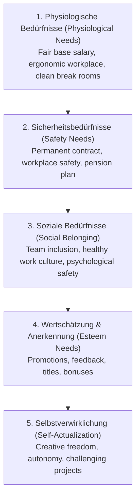

# Maslow's Hierarchy in Business, Team Dynamics, Motivation & ISO 9001 Quality Management
*Date: 03-09-2026* | *Category: #business-administration #people-management #quality-management*

---

## Context — Kontext

**🇬🇧** Today at school, we explored the human and organizational factors in business (**Lernfeld 1.3**): applying **Maslow's Hierarchy of Needs** to employee satisfaction, fostering effective teamwork while breaking down **silo thinking**, designing employee motivation and incentive structures, and establishing corporate reputation through **ISO 9001** Quality Management.

**🇩🇪** Heute haben wir im Rahmen von **Lernfeld 1.3** menschliche und organisatorische Erfolgsfaktoren im Unternehmen behandelt: die Anwendung der **Maslowschen Bedürfnispyramide** am Arbeitsplatz, erfolgreiche Teamarbeit zur Überwindung von **Silodenken**, Mitarbeiter-Motivationssysteme sowie Unternehmensreputation durch das **ISO 9001** Qualitätsmanagement.

---

## Key Topics — Hauptthemen

### 1. Maslow's Hierarchy in the Workplace — Bedürfnispyramide nach Maslow

**🇬🇧** Abraham Maslow's model categorizes human needs into 5 ascending tiers. In modern organizations, higher-level motivation is only unlocked once lower deficiency needs (*Defizitbedürfnisse*) are satisfied:
**🇩🇪** Maslows Modell unterteilt menschliche Bedürfnisse in 5 Stufen. Am Arbeitsplatz kann höhere Motivation erst greifen, wenn grundlegende Defizitbedürfnisse erfüllt sind:

| Level / Stufe | Workplace Implementation / Umsetzung im Betrieb | Category / Typ |
|---|---|---|
| **1. Physiologisch** | Base salary, ergonomic equipment, regular breaks / Grundgehalt, Arbeitsplatzgestaltung | Defizitbedürfnis |
| **2. Sicherheit** | Job security, health and safety, transparent contracts / Kündigungsschutz, Arbeitsschutz | Defizitbedürfnis |
| **3. Sozial** | Cross-functional team events, open communication / Teamkultur, Zugehörigkeitsgefühl | Defizitbedürfnis |
| **4. Wertschätzung** | Recognition, performance praise, promotions, titles / Lob, Beförderung, Statussymbole | Defizitbedürfnis |
| **5. Selbstverwirklichung** | Innovation time, independent decision-making, training / Eigenverantwortung, Freiräume | Wachstumsbedürfnis |

---

### 2. Teamwork & Overcoming Silo Mentality — Teamarbeit & Silodenken

- **🇬🇧** **Communication & Working Agreements:** High-performing teams establish explicit rules (Team Charter) covering meeting discipline, code reviews, and feedback cycles.
- **🇩🇪** **Kommunikation & Teamregeln:** Leistungsstarke Teams definieren klare Regeln (Team-Charta) für Meeting-Disziplin, Code-Reviews und Feedbackkultur.
- **🇬🇧** **Breaking Silo Thinking (*Silodenken vermeiden*):** Departmental silos occur when teams optimize only for their own sub-goals while ignoring the overall corporate process. Mitigated by cross-functional collaboration and shared KPIs.
- **🇩🇪** **Silodenken überwinden:** Silodenken entsteht, wenn Abteilungen nur ihre eigenen Ziele verfolgen und den Gesamtprozess ignorieren. Gegenmaßnahmen: interdisziplinäre Teams und gemeinsame KPIs.

---

### 3. Employee Motivation & Incentive Systems — Mitarbeitermotivation

| Incentive Type / Anreizart | Examples / Beispiele | Motivation Driver / Wirkungsweise |
|---|---|---|
| **Monetary (Extrinsic) / Monetär** | Salary raises, performance bonuses, profit sharing / Gehaltserhöhung, Prämien, Boni | Short-term boost; rapidly becomes expected baseline / Kurzfristige Wirkung |
| **Career & Education / Entwicklung** | Continuous training, certifications, mentorship / Weiterbildungen, Zertifizierungen, Coaching | Long-term engagement and competence growth / Nachhaltige Bindung |
| **Workplace Flexibility / Flexibilität** | Flexible hours (Gleitzeit), home office, trust-based time / Gleitzeit, Remote Work | Increases autonomy and work-life balance / Fördert Eigenverantwortung |
| **Corporate Benefits / Zusatzleistungen** | Gym subsidies, company canteen, public transit pass / Fitnessstudio, Jobticket, Kantine | Enhances workplace attractiveness and wellness / Steigert Arbeitgeberattraktivität |

---

### 4. Corporate Reputation & ISO 9001 Quality Management — Außenwirkung & ISO 9001

**Corporate Image / Außenwirkung:**
- A company’s market reputation is anchored in its verified history of delivery, transparent corporate values, and accredited industry certifications.

**ISO 9001 (Qualitätsmanagementsystem - QMS):**
- **🇬🇧** The globally leading standard for Quality Management. Focuses on customer satisfaction, structured process management, and the continuous improvement process (**KVP** / PDCA cycle: Plan-Do-Check-Act).
- **🇩🇪** Der weltweit führende Standard für Qualitätsmanagement. Kernfokus: Kundenzufriedenheit, strukturierte Prozessorientierung und der kontinuierliche Verbesserungsprozess (**KVP** / PDCA-Zyklus).

---

## Key Takeaway — Was ich gelernt habe

**🇬🇧**
- **Money prevents dissatisfaction, but growth creates motivation:** According to motivational theory and Maslow, base salary satisfies basic needs, but genuine motivation requires autonomy, learning, and recognition.
- **Quality is a process habit (ISO 9001):** Certifications like ISO 9001 prove to clients that quality is systematically engineered into every business process rather than left to chance.

**🇩🇪**
- **Gehalt verhindert Unzufriedenheit, Wachstum schafft Motivation:** Gemäß Maslow sichert das Gehalt die Basis, aber echte Leistungsbereitschaft entsteht durch Freiräume, Weiterbildung und Wertschätzung.
- **Qualität ist gelebter Prozess (ISO 9001):** Zertifizierungen wie ISO 9001 belegen gegenüber Kunden, dass Qualität systematisch in Geschäftsprozesse integriert ist und nicht dem Zufall überlassen wird.
