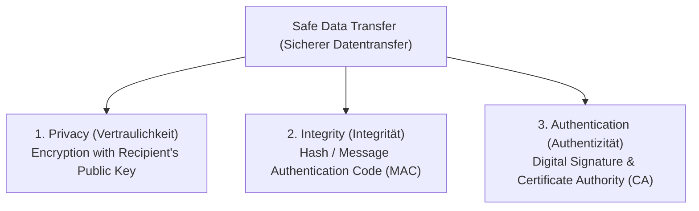

# Cryptographic PKI, VPN Protocols & Security Risks, Stateful Firewalls & IHK Task Strategy
*Date: 11-09-2026* | *Category: #cybersecurity #cryptography #vpn #ihk-exam-prep #technical-english*

---

## Context — Kontext

**🇬🇧** Today in Technical English & IT Systems (**LF6 / KW37 Tag 5**), we concluded the weekly intensive block by mastering the pillars of **secure data transfer** (public-key cryptography, message authentication codes, digital certificates), **VPN architectures & protocol evaluation** (IPsec transport vs. tunnel mode, OpenVPN, kill switches), **stateful firewalls and port scanning**, and specific answer strategies for **IHK exam operators**.

**🇩🇪** Heute haben wir in Fachenglisch & IT-Systeme (**LF6 / KW37 Tag 5**) die Intensivwoche abgeschlossen: die Säulen der **sicheren Datenübertragung** (Asymmetrische Kryptographie, Message Authentication Codes, digitale Zertifikate), **VPN-Architekturen & Protokollvergleiche** (IPsec Transport- vs. Tunnelmodus, OpenVPN, Kill Switches), **Stateful Firewalls & Portscans** sowie Lösungsstrategien für **IHK-Prüfungsoperatoren**.

---

## Key Topics — Hauptthemen

### 1. The Three Pillars of Safe Data Transfer — Schutzziele im Datentransfer

**Step-by-Step PKI Transmission Flow / Ablauf im Kryptosystem:**
1. **Hashing:** Sender generates a Message Authentication Code (MAC) from the plaintext document.
2. **Signing:** Sender encrypts the MAC with their **own private key** $\rightarrow$ produces the Digital Signature.
3. **Envelope Encryption:** Document + Signature are encrypted with the **recipient's public key**.
4. **Decryption:** Recipient decrypts the envelope with their **own private key** (ensuring Confidentiality).
5. **Verification:** Recipient decrypts the signature using the **sender's public key** and compares it to a locally computed MAC. If `Local MAC == Decrypted MAC`, Integrity and Authenticity are mathematically proven!

---

### 2. VPN Fundamentals & Protocol Matrix — VPN-Technologien im Vergleich

**VPN (Virtual Private Network):** Creates an encrypted, authenticated logical tunnel across an untrusted public network (Internet).
- **Remote Access (Client-to-Site):** Individual remote workers connect to the enterprise network via a software client.
- **Site-to-Site:** Connects entire branch office networks securely via hardware VPN gateways/routers.

| VPN Protocol | Security & Performance Profile / Bewertung | Port / Layer |
|---|---|---|
| **OpenVPN** | Open source, highly configurable, gold standard for security using OpenSSL (AES-256). | UDP/TCP (1194) / Transport |
| **IPsec (with IKEv2)** | Enterprise standard at IP layer. **Transport mode** (encrypts payload only) vs. **Tunnel mode** (encrypts entire packet + original header). Excellent for mobile reconnects. | UDP 500 / 4500 / Network Layer |
| **L2TP/IPsec** | Combines L2TP tunneling with IPsec encryption. Widely supported across mobile/desktop OS. | UDP 1701 / 500 |
| **WireGuard** | Modern, lean codebase (~4,000 lines), state-of-the-art cryptography, ultra-fast. | UDP / Kernel level |
| **PPTP** | Obsolete legacy protocol (MS-CHAPv2). Known cryptographic vulnerabilities $\rightarrow$ **strictly insecure!** | TCP 1723 |

**Critical VPN Security Risks & Features:**
- **DNS/WebRTC Leaks:** Traffic bypassing the tunnel $\rightarrow$ mitigated by strict *DNS Leak Protection*.
- **Tunnel Drops:** Connection disconnects exposing the real IP $\rightarrow$ prevented by an **Internet Kill Switch** (instantly blocks all unencrypted traffic if VPN drops).
- **Logging Policies:** Untrusted commercial VPNs logging user connection/traffic metadata.

---

### 3. Stateful Firewalls & Port Scans — Firewall & Portscans

- **Stateful Packet Inspection (SPI):** Unlike simple packet filters that evaluate packets in isolation, a stateful firewall tracks active connection states in a **State Table**. Inbound packets are automatically dropped unless they belong to an established outbound connection.
- **Port Scanning Techniques:** Used for defensive network auditing or reconnaissance (e.g. *Vanilla / Full TCP connect*, *SYN Stealth Scan*, *UDP Scan* across ports `1` to `65535`).

---

### 4. IHK English Exam Strategy — Operatoren & Lösungsstrategie

**Decoding IHK Exam Action Verbs (Operatoren):**

| Operator | Expected Output / Erwartete Leistung | Strategy / Vorgehen |
|---|---|---|
| **Name / Nennen** | List terms concisely without sentences / Begriffe knapp aufzählen | Bullet points only (no long paragraphs). |
| **Describe / Beschreiben** | Outline characteristics or workflows in full sentences / Merkmale sachlich darstellen | Complete sentences, factual, structured. |
| **Explain / Erläutern** | Provide context, causality, reasons, and effects / Zusammenhänge und Begründungen | Use causal signal words (*due to, because, hence*). |
| **Compare / Vergleichen** | Place two concepts side by side under identical criteria / Gegenüberstellung | Highlight differences and similarities explicitly. |

---

## Key Takeaway — Was ich gelernt habe

**🇬🇧**
- **Public keys encrypt, Private keys sign:** Understanding which key performs which role (Recipient Public Key = Confidentiality; Sender Private Key = Non-repudiation) is the core of cybersecurity architecture.
- **VPN protocol choice is a security policy:** Never allow legacy protocols like PPTP; always mandate OpenVPN, IPsec/IKEv2, or WireGuard with active Kill Switches.
- **IHK success is operator precision:** Answering an "Explain" question with a simple list ("Name") forfeits half the available points.

**🇩🇪**
- **Public Key verschlüsselt, Private Key signiert:** Die klare Zuordnung der Schlüsselrollen (Empfänger-Public-Key = Vertraulichkeit; Sender-Private-Key = Verbindlichkeit/Signatur) ist das Fundament der Kryptographie.
- **VPN-Protokollwahl ist Sicherheitspolitik:** Veraltete Protokolle wie PPTP dürfen nicht genutzt werden; der Standard sind OpenVPN, IPsec/IKEv2 oder WireGuard mit Kill-Switch.
- **IHK-Prüfungserfolg erfordert Operatorengenauigkeit:** Wer bei „Erläutern" nur eine Stichpunktliste liefert, verliert wertvolle Punkte.
